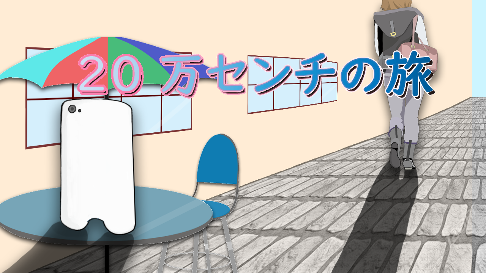
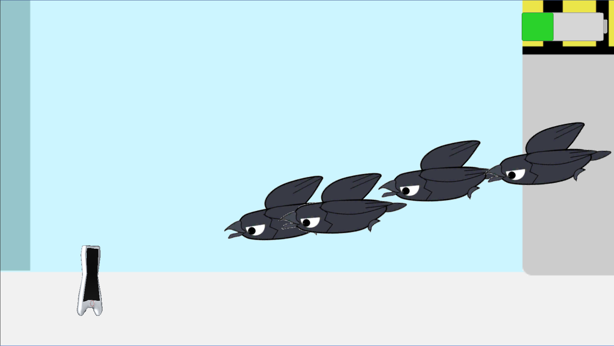

# ２０万センチの旅  

## ファイル構成  
* [Unityデータ](./SmartPhoneGame/)  
* [ビルドデータ]()  

## 概要  

## ジャンル  
横画面ランゲーム  

## プラットフォーム  
* [Androidビルドデータ]()    
* [Windowsビルドデータ]()  

## 担当プログラムファイル  
* [風船の操作](./SmartPhoneGame/Assets/Script/Action.cs)  
* [風船の判定](./SmartPhoneGame/Assets/Script/Balloon.cs)  
* [バッテリーの減少](./SmartPhoneGame/Assets/Script/Battery.cs)  
* [カメラが動く範囲](./SmartPhoneGame/Assets/Script/CameraRange.cs)  
* [ランキング](./SmartPhoneGame/Assets/Script/Ranking.cs)  

## ゲームストーリー  
ある喫茶店で女性がスマートフォンを置き忘れてしまった。  
スマートフォンの持ち主である女性のもとに、スマホくんが帰ろうとするお話。  

## ゲームルール  
画面をロングタップ、スワイプで風船を操りスマホくんを女性のもとに届ける。  
スマホくんのバッテリーが切れて動けなくなってしまうとゲーム終了。  
１～３ステージあり、３つのステージをクリアしてハイスコアを目指そう。 

## Unityバージョン  
2018.4.3f1  

## 制作期間  
２か月   

## メンバー（役割）  
* 伊山大心（プランナー）  
* 小禄隆世（デザイナー）  
* 宮城沙耶（プログラマ）  

## ゲームスクリーンショット  
  
  
  

